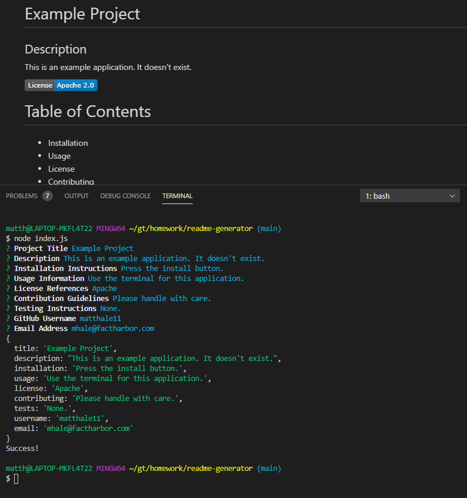

# README Generator

This application uses the NPM package Inquirer to generate a README file by prompting the following user inputs in the command line:
1. Project Title
2. Description
3. Installation Instructions 
4. Usage Information
5. Contribution Guidelines
6. Test Instructions
7. Licenses
8. GitHub Username
9. Email Address

From the command line, this app is initiated by entering the following command: `node index.js`

[README Generator Repo](https://github.com/matthale11/readme-generator)

